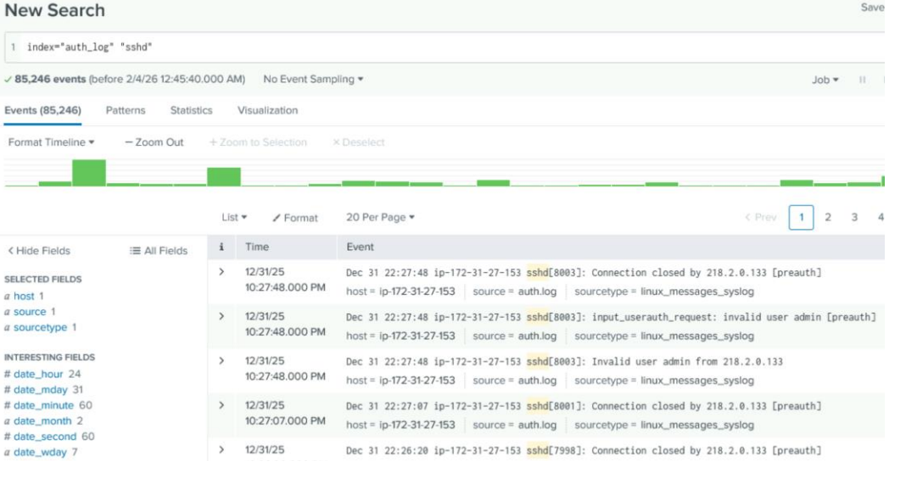
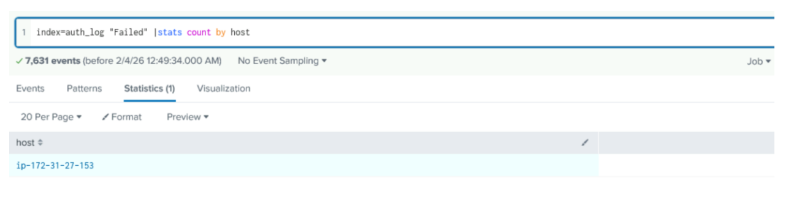

# Forensic Log Analysis Using Splunk

## Overview

This project focused on using Splunk to perform forensic analysis of authentication logs. Basic and advanced search queries were used to investigate SSH activity, identify repeated failed login attempts, detect potential brute-force behavior, and create visualizations that highlighted suspicious authentication patterns.

## Skills Demonstrated 

- SIEM Analysis
- Security Event Monitoring 
- Log Analysis Threat Detection
- Alert Creation
- Data Investigation

## Tools Used
- Splunk Enterprise
- Windows
- Web Server Log Data

## Investigation Process

Describe how imported data, searched the logs, identified suspicious IP addresses, analyzed traffic patterns, and created alerts.

## Key Findings 
Summarize your investigation findings.

Examples include:

- High-volume requests from specific IP addresses
- Suspicious traffic patterns
- Large outbound transfers
- Alert creation
- Evidence supporting further investigation

## Investigation Highlights

### Figure 1. Splunk Dashboard

The dashboard displays the imported log data used during the investigation.

---

### Figure 2. Search Results

Search queries were used to identify suspicious IP addresses and unusual network activity.

---

### Figure 3. Failed Login Attempt

Detect multiple failed login attempts from the same IP, use the following: index=auth_log "Failed password" | stats count by host

## Challenges

One of the biggest challenges during this investigation was working through a large volume of log data to identify activity that was actually relevant to the investigation. Writing effective search queries required some trial and error to narrow the results and focus on suspicious events. This project also reinforced the importance of understanding how to filter logs efficiently and create meaningful alerts that reduce unnecessary results.

## Project Artifacts

The original coursework is not published publicly. This portfolio project summarizes the investigation while protecting academic materials.

Artifacts included:

- Splunk dashboards
- Search queries
- Investigation screenshots
- Alert configuration

## Key Takeaways

This project strengthened my ability to investigate security events using Splunk, identify suspicious activity within large datasets, and document findings in a structured and repeatable manner.
