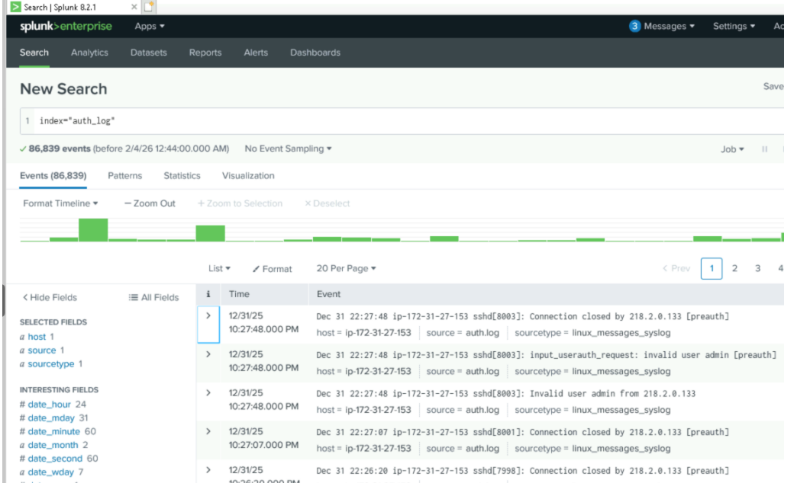

# Splunk Security Event analysis

## Overview
This project focused on analyzing security events using Splunk tp identify suspicious activity, investigate network traffic, and create alerts based on observed behaviors. The investigation demonstrated how Security and Event Management (SIEM) platform can assist analysts in monitoring and responding to potential security incidents.

## Skills Demonstrated 

- SIEM Analysis
- Security Event Monitoring 
- Log Analysis Threat Detection
- Alert Creation
- Data Investigation

## Tools Used
- Splunk Enterprise
- Windows
- Web Server Log Data

## Investigation Process

Describe how imported data, searched the logs, identified suspicious IP addresses, analyzed traffic patterns, and created alerts.

## Key Findings 
Summarize your investigation findings.

Examples include:

- High-volume requests from specific IP addresses
- Suspicious traffic patterns
- Large outbound transfers
- Alert creation
- Evidence supporting further investigation

## Investigation Highlights

### Figure 1. Splunk Dashboard

The dashboard displays the imported log data used during the investigation.

---

### Figure 2. Search Results

Search queries were used to identify suspicious IP addresses and unusual network activity.

---

### Figure 3. Failed Login Attempt

Detect multiple failed login attempts from the same IP, use the following: index=auth_log "Failed password" | stats count by host

## Challenges

Briefly describe any challenges encountered while working with Splunk.

## Project Artifacts

The original coursework is not published publicly. This portfolio project summarizes the investigation while protecting academic materials.

Artifacts included:

- Splunk dashboards
- Search queries
- Investigation screenshots
- Alert configuration

## Screenshots

## Key Takeaways

This project strengthened my ability to investigate security events using Splunk, identify suspicious activity within large datasets, and document findings in a structured and repeatable manner.
